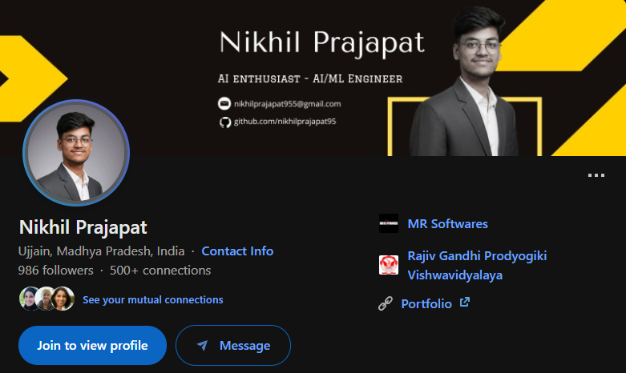

# Hi, I'm Nikhil Prajapat ! 👋

### 🚀 Python Developer & AI/ML Enthusiast

I am a passionate **Python Developer** currently working at **MR Software** in Ujjain. I specialize in building robust backend systems, scalable APIs, and integrating intelligent machine learning solutions. I am continuously learning and exploring new technologies to solve complex problems and elevate my engineering skills.

---

---
### 🛠️ Tech Stack & Skills

- **Backend Development:** Python, Django, FastAPI
- **AI / ML:** Machine Learning, Deep Learning, Data Analysis, Predictive Modeling
- **Databases & Tools:** SQL, Git & GitHub, RESTful APIs

---

### 📈 What I'm Up To Right Now

- 💻 **Current Role:** Building efficient backend systems at MR Software, Ujjain.
- 🚀 **Learning:** Deepening my expertise in AI/ML architectures and advanced system design.
- ⚡ **Goal:** Exploring cutting-edge technologies to enhance my development workflow and career growth.

---

### 🤝 Connect with Me

Let's connect and talk about Python, backend architectures, or the future of AI!

---

⚡ *“Continuous learning is the minimum requirement for success in any field.”*
